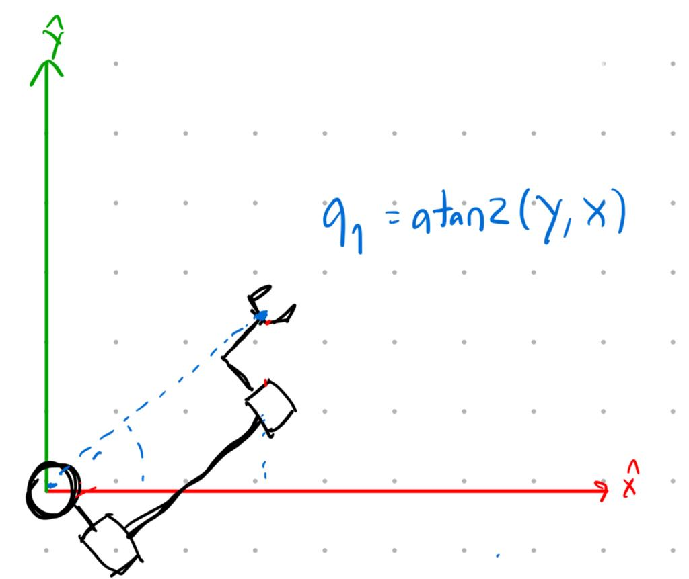
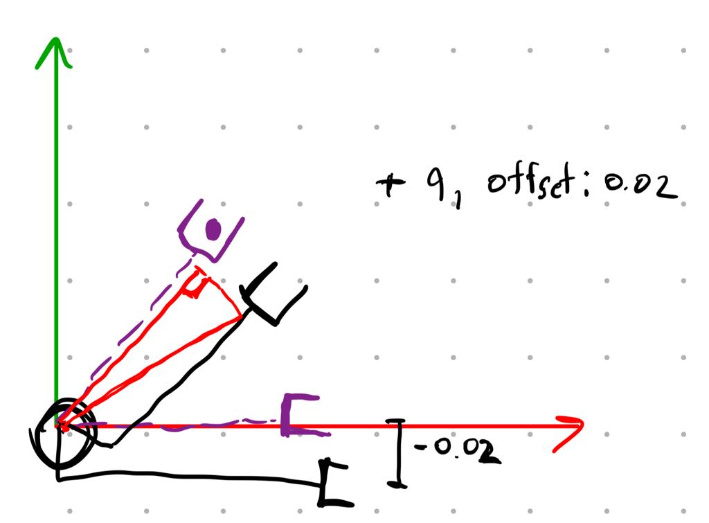
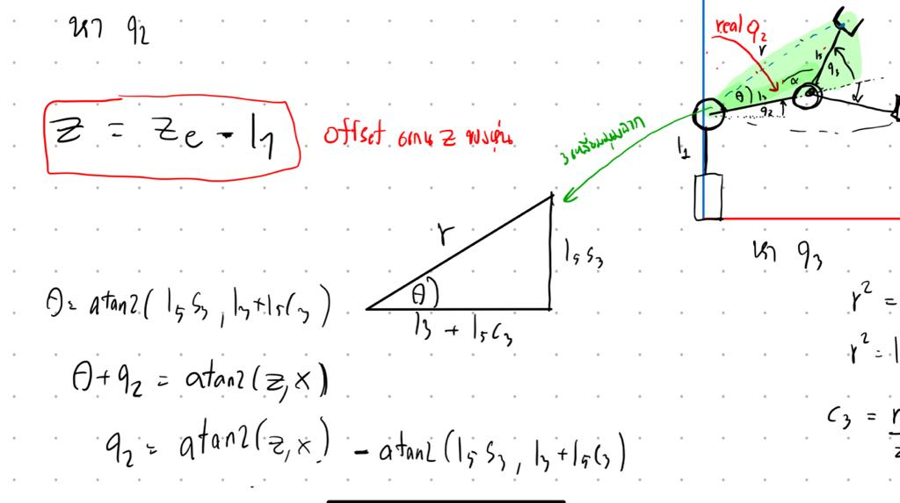
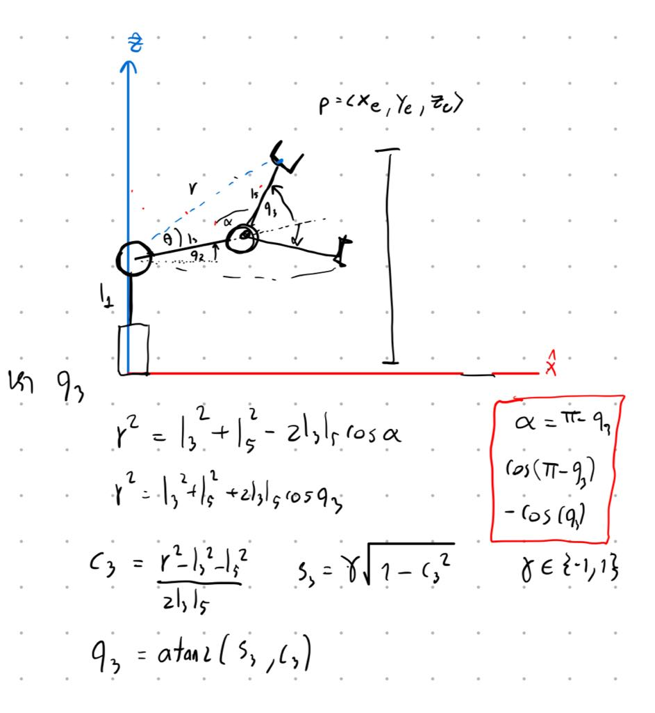
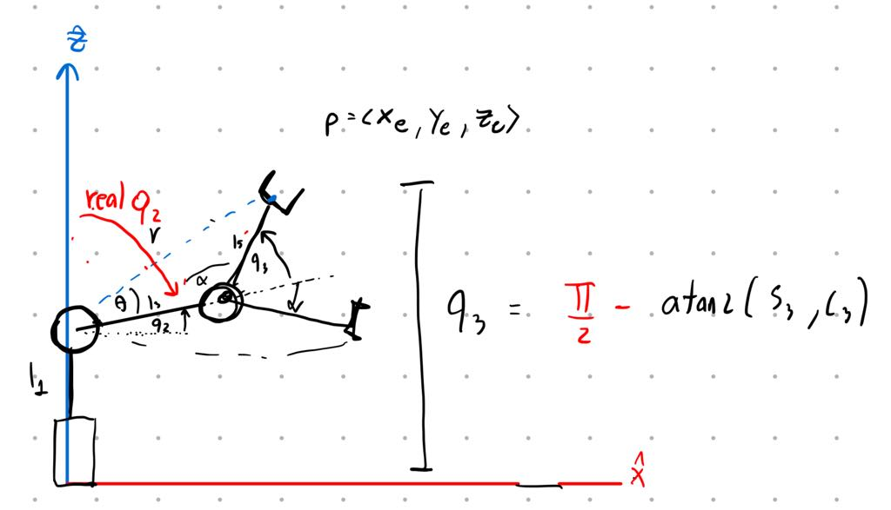
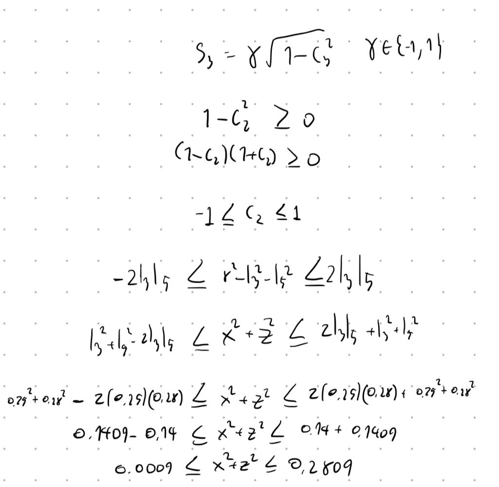
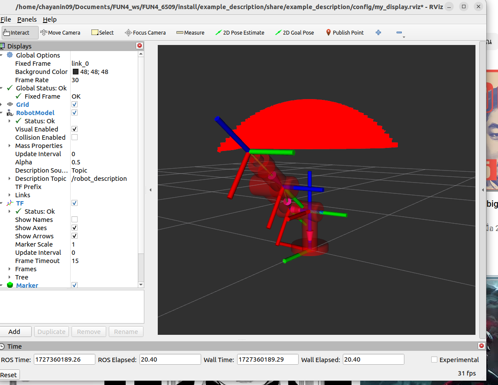

# FUN4_6509
## Part 1: Setup Environment
download หรือ clone workspace ไปที่ workspace ของคุณ
```sh
git clone https://github.com/ChayaninNapia/FUN4_6509
```
ลบ โฟลเดอร์  build, install, log จากนั้นทำการ build file ใหม่ ด้วยคำสั่ง colcon
```sh
colcon build
```
cd ไปที่ home จากนั้นแก้ไข ไฟล์ bashrc เพื่อ source ไฟล์
```sh
code .bashrc
```
เพิ่มโค้ดนี้ลงไปในบรรทัดสุดท้าย แทนที่ your_workspace ด้วย ที่อยู่ของ workspace ของคุณ
```sh
source ~/FUN4_6509/install/setup.bash
```
เปิด terminal ใหม่ แล้ว cd ไปที่ workspace จากนั้นทำการ source ไฟล์
```sh
code .bashrc
source install/setup.bash
```

### 1.หา workspace ของแขนกลพร้อมวิธีการตรวจสอบคําตอบ (1 คะแนน)
- คำนวณสมการ inverse kinematic ของ หุ่นยนต์เพื่อตรวจสอบ task workspace
  - หา q1

      - เนื่องจาก ปลายแขน เทียบกับ link 0 origin ของ end-effector จะมี offset แกน z ไป -0.02 ดังนั้นจึงต้องบวกมุมกลับเข้าไปถึงจะทำให้หุ่นหันหน้าตรงถูก

      - หา q2

      - หา q3

      - มุมที่หา เป็นมุมที่เทียบกับแกน X แต่ ต้องทำให้เป็นเทียบกับแกน Z เพื่อให้ตรงกับ joint ของ urdf

    - ค่า X <= l3 + l5, Y <= l3 + l5, Z <= l1 + l3 +l5
      
      
#### ตรวจคำตอบด้วย robotictoolbox


```python
# Add your Python code here
import roboticstoolbox as rtb
from math import pi
import numpy as np
from spatialmath import SE3

l1 = 0.2    # 200 mm
l2 = 0.06   # 60 mm
l3 = 0.25   # 250 mm
l4 = 0.1    # 100 mm
l5 = 0.28   # 280 mm

robot = rtb.DHRobot(
    [
        rtb.RevoluteMDH(d=l1, alpha=0, offset=0), 
        rtb.RevoluteMDH(alpha=-pi/2, offset=-pi/2),  
        rtb.RevoluteMDH(a=l3, d=-0.02, offset=pi/2), 
        rtb.RevoluteMDH(alpha=pi/2, d=l5, offset=0) 
    ],
    name="robot"    
)
q_initial = [0.970, 0.595, 1.411, 0]
T_0e = robot.fkine(q_initial)

'''for display'''
# robot.plot(q_initial)
# print("Forward Kinematics (T_0e):")
# print(T_0e)
# print(robot)

def ikine_find(desired_pose,s):
    solution = robot.ikine_LM(desired_pose)

    if solution.success:
        q_ik = solution.q
        print("Inverse Kinematics converge Solution:")
        print(q_ik)
        T_verification = robot.fkine(q_ik)
        print("Verification :")
        print(T_verification)
        robot.plot(q_ik)
    else:
        print(s)
        print("Inverse Kinematics did not converge to a solution.")
        print()
        
#case 1 X <= l3 + l5
ikine_find(SE3(l3+l5+1.0, -0.02, 0.73),'case 1: X <= l3 + l5')
#case 2 Y <= l3 + l5
ikine_find(SE3(0.0, l3+l5+1.0, 0.73),'case 2: Y <= l3 + l5')
#case 3 Z <= l1 + l3 + l5
ikine_find(SE3(0.0, -0.02, l1 + l3 + l5 + 1),'case 3: Z <= l1 + l3 + l5')
#case 4  0.0009  <= x^2 + z^2 <= 0.2809 
ikine_find(SE3(l3+l5+1.0, -0.02, 0.73),'case 4:  0.0009  <= x^2 + z^2 <= 0.2809')
#case 4 reachable
ikine_find(SE3(0.0, -0.02, 0.73),'case 4:')

```
```sh
case 1: X <= l3 + l5
Inverse Kinematics did not converge to a solution.

case 2: Y <= l3 + l5
Inverse Kinematics did not converge to a solution.

case 3: Z <= l1 + l3 + l5
Inverse Kinematics did not converge to a solution.

case 4:  0.0009  <= x^2 + z^2 <= 0.2809
Inverse Kinematics did not converge to a solution.

Inverse Kinematics converge Solution:
[-0.13695534  0.01058346 -0.01058348  0.13695546]
Verification :
   1        -1.201e-07 -1.896e-08 -0.0001095  
   1.201e-07  1         2.613e-09 -0.02017   
   1.896e-08 -2.613e-09  1         0.73      
   0         0         0         1       
```

### plot workpace with rviz marker

```sh
ros2 launch robot_control robot_bringup.launch.py mode:=0
```
เมื่อ run ไฟล์นี้ หุ่นยนต์จะค่อยๆพลอต workspace outter bound ที่หุ่นยนต์สามารถขยับไปได้ ลักษณะเป็นทรงกลม 

 

 ### 2.สร้าง node สําหรับสุ่มเป้าหมายตําแหน่งปลายมือภายใน workspace ของแขนกลใน topic ที่มีชื่อว่า /target (msg type: PoseStamped) และแสดงผลผ่าน RVIZ2 (0.5 คะแนน)
 ```sh
ros2 launch robot_control robot_bringup.launch.py mode:=1
```
เมื่อรันไฟล์นี้ โหนดที่ชื่อ /random_position_node จะทำการสุ่มตำแหน่งและ publish topic /target: geometry_msgs/msg/PoseStamped ออกมาทุกๆ 5 วินาที

เช็ค ข้อมูลของโนหด /random_position_node
 ```sh
ros2 node info /random_position_node
```
ดูข้อมูลที่ publish ออกมา
```sh
ros2 topic echo /target 
````
### 3.ส่งค่าตําแหน่งปลายมือผ่าน topic /end_effector (msg type: PoseStamped) และแสดงผลผ่าน RVIZ2
 ```sh
ros2 launch robot_control robot_bringup.launch.py mode:=1 
```
เมื่อรันไฟล์นี้จะปรากฏหน้าต่าง gui และ rviz โดยมี node /roint_sub_node sub tf ของ end-effector เทียบ base 

เช็คข้อมูลที่ออกมา

```sh
ros2 topic echo /end_effector
```
## Part 2: Controller

```sh
ros2 launch robot_control robot_bringup.launch.py mode:=2
```
### 1. mode 1 Inverse Pose Kinematics (IPK)
เปลี่ยนเป็นโหมด 1
```sh
ros2 service call /change_mode robot_action/srv/ChangeMode "mode: 1"  
```
เรียก service เพื่อระบุ task ที่ต้องการ ตัวอย่าง

```sh
ros2 service call /set_taskspace robot_action/srv/SetTaskspace "{x: 0.28, y: -0.1, z: 0.2}"

```

เมื่อtaskไม่ได้อยู่ใน workspace จะ response success=False

```sh
ros2 service call /set_taskspace robot_action/srv/SetTaskspace "{x: 0.28, y: -0.1, z: 1.2}"
waiting for service to become available...
requester: making request: custom_interface.srv.SetTaskspace_Request(x=0.28, y=-0.1, z=1.2)

response:
custom_interface.srv.SetTaskspace_Response(success=False)

```
สามารถเปิดแท็บใหม่ แล้วใช้เครื่องมือ tf2 ในการเช็คความถูกต้องของ tranformation
```sh
ros2 run tf2_ros tf2_echo link_0 end_effector
```
### 2. mode 2 Teleoperation
เปลี่ยนเป็นโหมด 2
```sh
#Teleoperation base reference
ros2 service call /change_mode robot_action/srv/ChangeMode "mode: 20"
or
#Teleoperation end_effector reference
ros2 service call /change_mode robot_action/srv/ChangeMode "mode: 21" 
```

เปิด หน้าต่างใหม่ รัน teleop_twist_keyboard
```sh
ros2 run teleop_twist_keyboard teleop_twist_keyboard
```

กด shift ค้างแล้วตามด้วย ปุ่มใน Holonomic mode 
เมื่อหุ่นขยับไปจนใกล้ จะเกิด ingularity ที่หน้าterminal ของ launch ไฟล์ จะแสดงข้อความเตือน และ ต้อง เรียก service /sethome และตั้งโหมดใหม่อีกครั้ง
```sh
[robot_server.py-5] [WARN] [1727524432.934874109] [robot_server]: Manipulability is too low or NaN: 0.000779403431579281. Approaching singularity!
[robot_server.py-5] [WARN] [1727524432.935113762] [robot_server]: please set home and set mode again
```
```sh
ros2 service call /sethome std_srvs/srv/SetBool "{data: false}" 
```

### 3. mode 3  Auto

```sh
ros2 service call /change_mode robot_action/srv/ChangeMode "mode: 3" 
```
ลำดับการทำงานของ โหมด 3
1. /robot_server_node request ตำแหน่งจาก /random_target_publisher
2. /random_target_publisher response ตำแหน่ง เป็น PoseStamped
3. /robot_server_node ส่ง goal ไปที่ /robot_action_server_node
4. เมื่อ /robot_action_server_node ทำงานสำเร็จ จะส่ง result ไปที่ /robot_server_node
5. /robot_server_node วนลูป request ตำแหน่งใหม่ เมื่อมีการเปลี่ยนโหลดจะ cancel goal ปัจจุบัน
